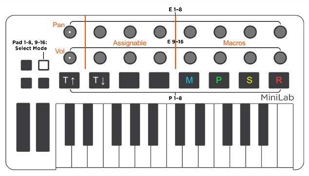

# Arturia MiniLab Mk II for Bitwig

## Setup

- Place `minilab-mk2.control.js` into `~/Documents/Bitwig Studio/Controller Scripts`.
- Choose the controller script from `Settings -> Controller -> Add controller manually`.
- Select `Arturia MiniLab mkII` as input and output each.

- Open Arturia MIDI Control Center, change each knob to `Option: Relative #1`, save as preset and load onto the device memory.
- On the MiniLab, press shift and select the corresponding memory slot.

## Usage

- Pads 1 to 8 function as normal MIDI notes / drum pads.
- Pads 9 to 16 (after pressing the pad selector) function as following:
	- Pad 9 & 10 (white) – Scroll between tracks.
	- Pad 11 & 12 – Unassigned.
	- Pad 13 (blue) – Toggle metronome.
	- Pad 14 (green) – Toggle play/pause.
	- Pad 15 (yellow) – Stop playback.
	- Pad 15 (red) – Toggle recording.

- The knobs are divided vertically and function as following:
	- Knob 1 & 9 control pan and volume of the currently selected track. Click the knob to reset.
	- Knob 2, 3, 4 & 10, 11, 12 are freely assignable in Bitwig.
	- Knob 5, 6, 7, 8 & 13, 14, 15, 16 control the macros of the currently selected device.

# Contact

- [bequadro](https://twitter.com/_bequadro)